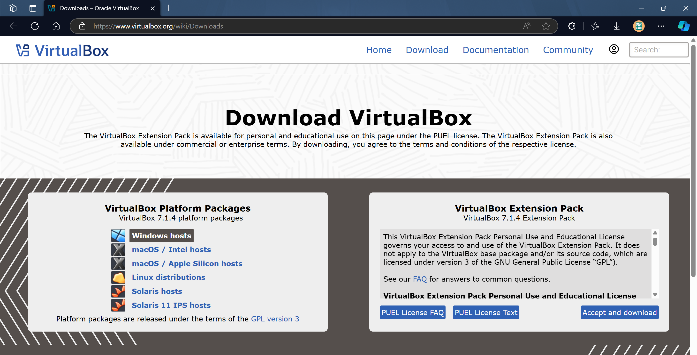
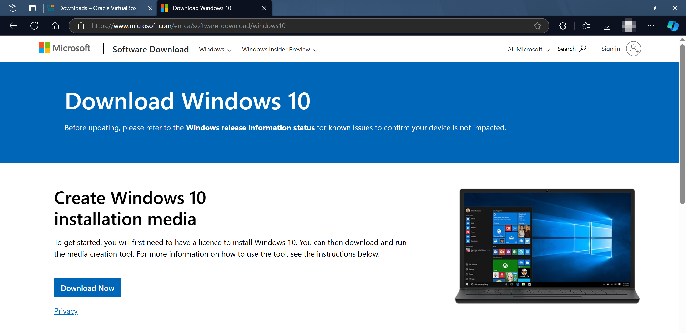
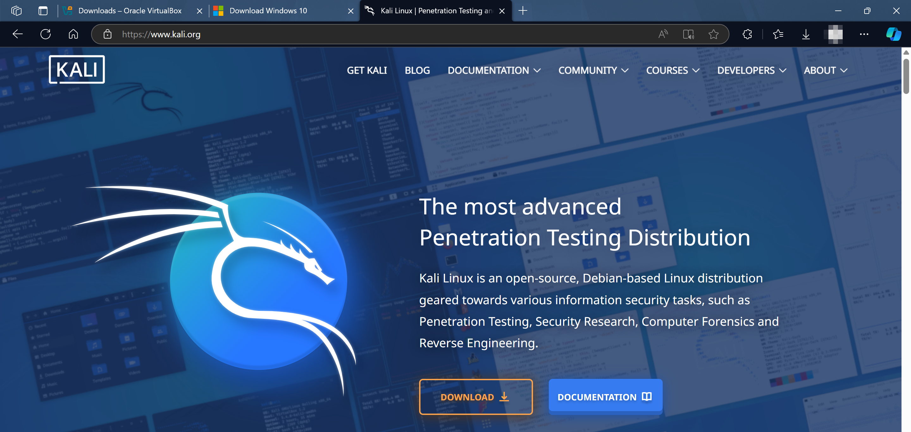
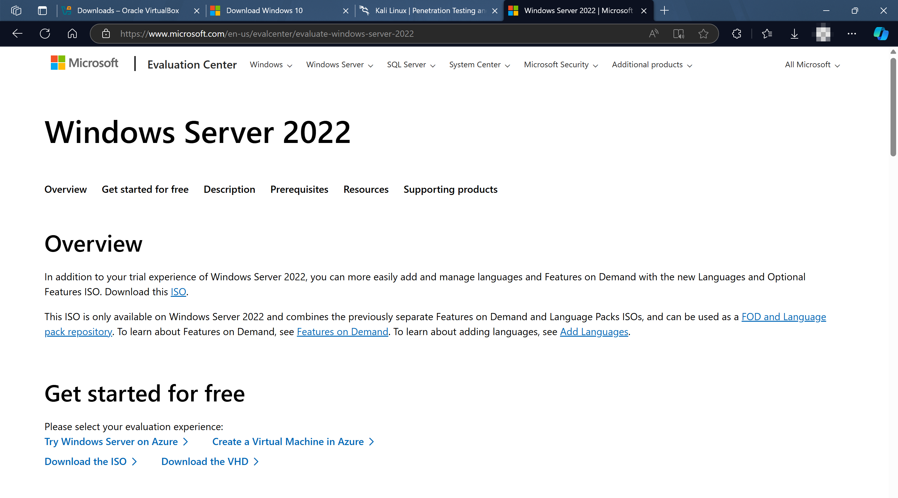
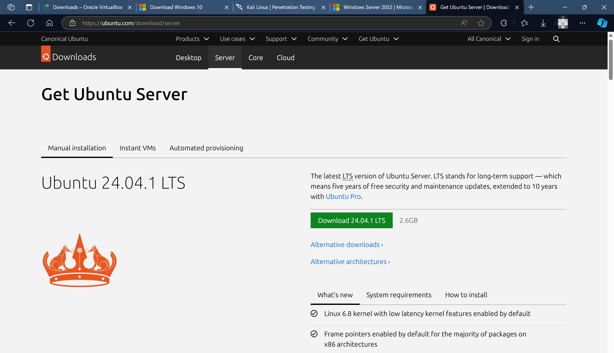

# `Part 2` Project Setup and Diagram Design

In `Part 2` of the **Active Directory project**, we'll bring our lab environment to life by setting up **virtual machines for Active Directory, Splunk, and client devices**. This section covers installing operating systems, configuring network settings, and preparing the Active Directory domain controller. By the end, our lab will be fully operational and ready for hands-on security and monitoring activities.

### Prerequisites

1. **Diagram**<br>Have your network diagram from Part 1 ready.
2. **Virtualization**<br>Install [VirtualBox](https://www.virtualbox.org/) (version 7.0 or above).
3. **System**<br>If using an M1/M2 Mac, consider using cloud providers like Vulture or Microsoft Azure for compatibility.

## `Step 1` Install VirtualBox

1. Visit [virtualbox.org](https://www.virtualbox.org/).
2. Download the installer for your OS and verify the SHA-256 checksum:
   - **On Windows**: Open PowerShell in the Downloads folder.
   - Run: `Get-FileHash .\yourdownloadedfile.iso` and confirm it matches the provided checksum.

3. Install VirtualBox:
   - **If prompted**, install the Microsoft Visual C++ 2019 package dependency.
   - Follow on-screen instructions and set default installation options.



## `Step 2` Download and Create Windows 10 VM

1. Download the [Windows Media Creation Tool](https://www.microsoft.com/software-download/windows10) and create a Windows 10 ISO file.
2. In VirtualBox, create a new VM:
   - Set a name, choose your storage folder, and upload the Windows 10 ISO file.
   - Customize specs based on your system (4GB RAM, 1 CPU).
   - Set storage to 50GB.

3. **Power on the VM** and follow the Windows installation steps:
   - Skip entering a product key.
   - Choose **Windows 10 Pro**, agree to the terms, and select a **Custom Install**.
   - Windows should now install.



## `Step 3` Download and Create Kali Linux VM

1. Visit [kali.org](https://www.kali.org/), select the **VirtualBox** option under downloads.
2. Verify whether your system is **32-bit** or **64-bit**:
   - On Windows, check **System Information** under Control Panel.

3. Download and extract Kali Linux VM files:
   - Use [7-Zip](https://www.7-zip.org/) to extract files.
   - Import the `.vbox` file into VirtualBox.
   - **Log in** with default credentials:
     - **Username**: kali
     - **Password**: kali



## `Step 4` Download and Create Windows Server 2022 VM

1. Go to the [Microsoft Evaluation Center](https://www.microsoft.com/en-us/evalcenter/evaluate-windows-server-2022) and download the **Windows Server 2022** ISO.
2. In VirtualBox, create a new VM:
   - Name the VM, select a storage folder, and upload the ISO.
   - For hardware:
     - Set **RAM** to 4GB for installation (adjust later if needed).
     - Set **Storage** to 50GB.
3. **Install Windows Server**:
   - Select **Windows Server 2022 Standard Edition with Desktop Experience**.
   - Create a strong **administrator password** when prompted.



## `Step 5` Download and Create Ubuntu Server VM

1. Visit [ubuntu.com](https://ubuntu.com/download/server) and download **Ubuntu Server 22.04**.
2. In VirtualBox, create a new VM:
   - Set the name as `Splunk Server`, and select the ISO file.
   - For hardware, allocate **8GB RAM** and **100GB storage**.
3. **Install Ubuntu Server**:
   - Follow the on-screen instructions for a guided install.
   - Set up a **username** and **password**.
   - **Skip SSH** setup if you prefer.



## `Step 6` Update Ubuntu

1. **Log into Ubuntu** with the username and password you created.
2. Run the following commands to update:
   ```bash
   sudo apt-get update
   sudo apt-get upgrade -y
   ```


## Conclusion

By completing Part 2, you now have the following setup

- **VirtualBox**<br>Installed and configured.
- **Virtual Machines**<br>Created for Windows 10, Kali Linux, Windows Server 2022, and Ubuntu Server.
- **Operating Systems**<br>Installed and set up on each VM.

In **Part 3**, we will install and configure Sysmon and Splunk on the Windows target machine and server to enable telemetry collection and log forwarding.
